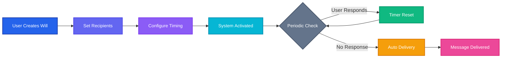
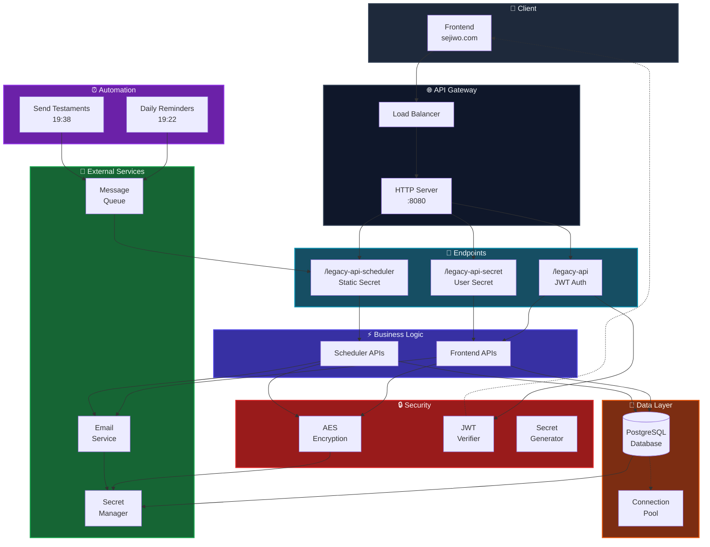
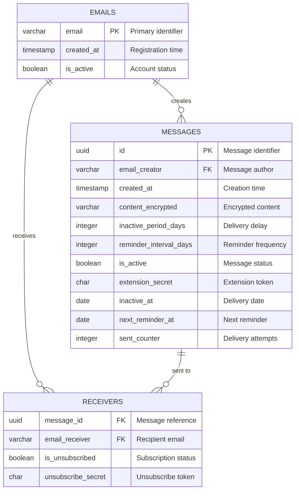

# legacy-api
Backend API code for [sejiwo.com](https://sejiwo.com/)

For compiler versions and security checks, see [Dependency checks](docs/dependencies.md).

For optional Telegram login, reminders, and final delivery, see [Telegram setup](docs/telegram.md). Production templates enable Telegram. Other environments keep it disabled unless explicitly enabled. Apply both Telegram migrations before the first production deployment.

## How Sejiwo Works

Sejiwo is an automated digital will service that delivers your final message to loved ones only if you become unresponsive.


```mermaid
flowchart LR
    A[User Creates Will] --> B[Set Recipients]
    B --> C[Configure Timing]
    C --> D[System Activated]
    
    D --> E{Periodic Check}
    E -->|User Responds| F[Timer Reset]
    E -->|No Response| G[Auto Delivery]
    
    F --> E
    G --> H[Message Delivered]
    
    style A fill:#2563eb,stroke:#1e40af,stroke-width:2px,color:#ffffff
    style B fill:#6366f1,stroke:#4f46e5,stroke-width:2px,color:#ffffff
    style C fill:#8b5cf6,stroke:#7c3aed,stroke-width:2px,color:#ffffff
    style D fill:#06b6d4,stroke:#0891b2,stroke-width:2px,color:#ffffff
    style E fill:#64748b,stroke:#475569,stroke-width:2px,color:#ffffff
    style F fill:#10b981,stroke:#059669,stroke-width:2px,color:#ffffff
    style G fill:#f59e0b,stroke:#d97706,stroke-width:2px,color:#ffffff
    style H fill:#ec4899,stroke:#db2777,stroke-width:2px,color:#ffffff
    
    classDef default font-size:14px,font-weight:500
```

### Key Features:
- ⏰ **Automatic Delivery**: Messages delivered only when you don't respond to reminders
- 🔒 **Secure**: AES encrypted message storage
- 📧 **Flexible Recipients**: Send to up to 3 people
- 🔄 **Stay in Control**: Easy to postpone or cancel anytime
- ⚡ **Set and Forget**: Fully automated once configured

📋 **[View Technical Architecture & System Details](#technical-architecture)**

## Prerequisites
- [Go 1.27.1](https://go.dev/doc/install)
- [Postgresql 17.6](https://www.postgresql.org/download/)
- [sqlc](https://docs.sqlc.dev/en/latest/overview/install.html) (Optional, for generating db structs from data/schema.sql & data/query.sql)
- [pgAdmin4](https://www.pgadmin.org/download/) (Optional, to manage the database or use psql instead)
- [gcloud cli](https://cloud.google.com/sdk/docs/install) (Optional, for deploying the api to Google Cloud Platform)

## Development
### Database setup
After installing go & postgresql
```sh
./init-db.sh # Prepare dev database - set proper passwords & secrets for production
```

### Testing
This is integration test, you will need to run the database first before running the test
```sh
cp .env-test-template.yaml .env-test.yaml
go test ./...
```
Why do I use template config? Because I put secrets in my `.env-test.yaml` & I don't want to accidentally commit it. Please let me know how to do it better.

### Running the app in localhost
From the root directory of this repo
```sh
# You need to specify the env because the default value is "test"
# and I use the env to customize static file directories
ENVIRONMENT=dev go run cmd/main.go # Or just use vscode debug feature
```

### API call examples
1. Install [thunder client](https://www.thunderclient.com/), a vscode extension similar to postman
2. Import `thunder-collection_legacy-api.json` from thunder client

## Deployment

Production uses `cloudbuild.yaml` and the two `.env-prod-*-template.yaml` files. These files define public settings and Secret Manager references. Secret values must stay in Secret Manager. Dashboard changes alone do not survive a deployment that replaces environment variables from these files.

The production API uses `SejiwoBot` with Client ID `8927237838`. Both production services enable Telegram. Read [Telegram setup](docs/telegram.md) for the required database migrations, secret names, webhook registration, daily jobs, checks, and rollback steps. For a new environment, start with Telegram disabled until those steps are complete.

Cloud Build runs integration tests before it deploys the API and scheduler. Each shell step stops on failure. Secret updates are additive and use `latest`; they preserve other secret references. The API image build must succeed before Cloud Run can deploy it.

Use only the isolated test database for tests. Never run `data/schema.sql`, seed files, or tests against production. For an existing production database, back up the database and apply only the required migrations.

The existing Cloud Scheduler jobs are managed in the dashboard. Their schedules and message attributes are recorded in [Telegram setup](docs/telegram.md#production-schedules). Ordinary app deployments do not create or modify these jobs.

---

## Technical Architecture

### System Architecture


```mermaid
graph TB
    subgraph CLIENT ["📱 Client"]
        WEB[Frontend<br/>sejiwo.com]
    end
    
    subgraph GATEWAY ["🌐 API Gateway"]
        LB[Load Balancer]
        MAIN[HTTP Server<br/>:8080]
    end
    
    subgraph API ["🔌 Endpoints"]
        API1["/legacy-api<br/>JWT Auth"]
        API2["/legacy-api-secret<br/>User Secret"]
        API3["/legacy-api-scheduler<br/>Static Secret"]
    end
    
    subgraph LOGIC ["⚡ Business Logic"]
        FRONTEND[Frontend APIs]
        SCHEDULER[Scheduler APIs]
    end
    
    subgraph DATA ["💾 Data Layer"]
        DB[(PostgreSQL<br/>Database)]
        CACHE[Connection<br/>Pool]
    end
    
    subgraph EXTERNAL ["🔗 External Services"]
        MAILJET[Email<br/>Service]
        SECRETS[Secret<br/>Manager]
        PUBSUB[Message<br/>Queue]
    end
    
    subgraph SECURITY ["🔒 Security"]
        ENC[AES<br/>Encryption]
        JWT[JWT<br/>Verifier]
        SEC[Secret<br/>Generator]
    end
    
    subgraph CRON ["⏰ Automation"]
        CRON1[Daily Reminders<br/>19:22]
        CRON2[Send Testaments<br/>19:38]
    end
    
    %% Primary Flow
    WEB --> LB
    LB --> MAIN
    MAIN --> API1 & API2 & API3
    
    API1 & API2 --> FRONTEND
    API3 --> SCHEDULER
    
    FRONTEND & SCHEDULER --> DB
    FRONTEND & SCHEDULER --> ENC
    
    %% External Connections
    DB -.-> CACHE
    FRONTEND & SCHEDULER --> MAILJET
    ENC & MAILJET & DB --> SECRETS
    
    %% Authentication
    API1 --> JWT
    JWT -.-> WEB
    
    %% Scheduling
    CRON1 & CRON2 --> PUBSUB
    PUBSUB --> API3
    
    %% Modern Styling
    style CLIENT fill:#1e293b,stroke:#334155,stroke-width:2px,color:#f1f5f9
    style GATEWAY fill:#0f172a,stroke:#334155,stroke-width:2px,color:#f1f5f9
    style API fill:#164e63,stroke:#0891b2,stroke-width:2px,color:#f0f9ff
    style LOGIC fill:#3730a3,stroke:#4f46e5,stroke-width:2px,color:#f0f9ff
    style DATA fill:#7c2d12,stroke:#ea580c,stroke-width:2px,color:#fef7ed
    style EXTERNAL fill:#166534,stroke:#16a34a,stroke-width:2px,color:#f0fdf4
    style SECURITY fill:#991b1b,stroke:#dc2626,stroke-width:2px,color:#fef2f2
    style CRON fill:#6b21a8,stroke:#9333ea,stroke-width:2px,color:#faf5ff
```

### Database Schema


```mermaid
erDiagram
    EMAILS {
        varchar email PK "Primary identifier"
        timestamp created_at "Registration time"
        boolean is_active "Account status"
    }
    
    MESSAGES {
        uuid id PK "Message identifier"
        varchar email_creator FK "Message author"
        timestamp created_at "Creation time"
        varchar content_encrypted "Encrypted content"
        integer inactive_period_days "Delivery delay"
        integer reminder_interval_days "Reminder frequency"
        boolean is_active "Message status"
        char extension_secret "Extension token"
        date inactive_at "Delivery date"
        date next_reminder_at "Next reminder"
        integer sent_counter "Delivery attempts"
    }
    
    RECEIVERS {
        uuid message_id FK "Message reference"
        varchar email_receiver FK "Recipient email"
        boolean is_unsubscribed "Subscription status"
        char unsubscribe_secret "Unsubscribe token"
    }
    
    EMAILS ||--o{ MESSAGES : creates
    EMAILS ||--o{ RECEIVERS : receives
    MESSAGES ||--o{ RECEIVERS : "sent to"
```

### Key Technical Features:
- **🏗️ Architecture**: Go HTTP server on Google Cloud Run
- **🔐 Security**: AES encryption, JWT authentication, secret management
- **📊 Database**: PostgreSQL with optimized indexes for queries
- **📧 Email**: Mailjet integration with HTML templates
- **⏰ Scheduling**: Google Cloud Scheduler + Pub/Sub
- **🔄 Scalability**: Stateless design, connection pooling
- **📈 Monitoring**: Structured logging and error handling
- **🛡️ Reliability**: Transaction-based operations, retry logic
