# legacy-api
Backend API code for [sejiwo.com](https://sejiwo.com/)

## How Sejiwo Works

Sejiwo is an automated digital will service that delivers your final message to loved ones only if you become unresponsive.

```mermaid
flowchart LR
    A[👤 User visits<br/>sejiwo.com] --> B[📝 Write will<br/>message]
    B --> C[📧 Add recipients<br/>Max 3 people]
    C --> D[⏱️ Set timing<br/>preferences]
    D --> E[🔒 Encrypted &<br/>stored safely]
    
    E --> F{📅 Time passes}
    F --> G[📬 Reminder<br/>emails sent]
    G --> H{🤔 Response?}
    H -->|✅ Yes| I[🔄 Reset timer]
    H -->|❌ No| J[📨 Auto-deliver<br/>to recipients]
    
    I --> F
    J --> K[💌 Recipients get<br/>final message]
    
    style A fill:#e1f5fe
    style K fill:#f3e5f5
    style J fill:#fff3e0
```



### Key Features:
- ⏰ **Automatic Delivery**: Messages delivered only when you don't respond to reminders
- 🔒 **Secure**: AES encrypted message storage
- 📧 **Flexible Recipients**: Send to up to 3 people
- 🔄 **Stay in Control**: Easy to postpone or cancel anytime
- ⚡ **Set and Forget**: Fully automated once configured

<details>
<summary><strong>📋 Technical Architecture Details</strong></summary>

## System Architecture

```mermaid
graph TB
    subgraph "Client Layer"
        WEB[🌐 sejiwo.com Frontend<br/>Netlify Identity JWT]
    end
    
    subgraph "API Gateway Layer"
        LB[⚖️ Load Balancer<br/>Google Cloud Run]
        MAIN[🚀 main.go HTTP Server<br/>Port 8080]
    end
    
    subgraph "API Endpoints"
        API1[🔐 /legacy-api<br/>JWT Authentication]
        API2[🔑 /legacy-api-secret<br/>User Secret Auth]
        API3[⏰ /legacy-api-scheduler<br/>Static Secret Auth]
    end
    
    subgraph "Business Logic Layer"
        FRONTEND[🎯 Frontend APIs<br/>CRUD Operations]
        SCHEDULER[📅 Scheduler APIs<br/>Automated Tasks]
    end
    
    subgraph "Data Layer"
        DB[(🗄️ PostgreSQL Database<br/>Supabase)]
        CACHE[💾 Connection Pool<br/>pgx/v5]
    end
    
    subgraph "External Services"
        MAILJET[📧 Mailjet<br/>Email Service]
        SECRETS[🔐 Google Cloud<br/>Secret Manager]
        PUBSUB[📨 Google Cloud<br/>Pub/Sub]
    end
    
    subgraph "Security Layer"
        ENC[🔒 AES Encryption<br/>Message Content]
        JWT[🎫 JWT Verifier<br/>Netlify Identity]
        SEC[🔑 Secret Generator<br/>Extension & Unsubscribe]
    end
    
    subgraph "Scheduled Jobs"
        CRON1[⏰ Daily 19:22<br/>Send Reminders]
        CRON2[⏰ Daily 19:38<br/>Send Testaments]
    end
    
    %% User Flow
    WEB --> LB
    LB --> MAIN
    MAIN --> API1
    MAIN --> API2
    MAIN --> API3
    
    %% API Routes
    API1 --> FRONTEND
    API2 --> FRONTEND
    API3 --> SCHEDULER
    
    %% Business Logic
    FRONTEND --> DB
    SCHEDULER --> DB
    FRONTEND --> ENC
    SCHEDULER --> ENC
    
    %% Authentication
    API1 --> JWT
    JWT --> WEB
    
    %% Data Flow
    DB --> CACHE
    FRONTEND --> MAILJET
    SCHEDULER --> MAILJET
    
    %% Secrets
    ENC --> SECRETS
    MAILJET --> SECRETS
    DB --> SECRETS
    
    %% Scheduling
    CRON1 --> PUBSUB
    CRON2 --> PUBSUB
    PUBSUB --> API3
    
    style WEB fill:#e3f2fd
    style DB fill:#f3e5f5
    style MAILJET fill:#fff3e0
    style SECRETS fill:#ffebee
    style ENC fill:#e8f5e8
```



## Database Schema


### Key Technical Features:
- **🏗️ Architecture**: Go HTTP server on Google Cloud Run
- **🔐 Security**: AES encryption, JWT authentication, secret management
- **📊 Database**: PostgreSQL with optimized indexes for queries
- **📧 Email**: Mailjet integration with HTML templates
- **⏰ Scheduling**: Google Cloud Scheduler + Pub/Sub
- **🔄 Scalability**: Stateless design, connection pooling
- **📈 Monitoring**: Structured logging and error handling
- **🛡️ Reliability**: Transaction-based operations, retry logic

</details>

## Prerequisites
- [Go 1.24](https://go.dev/doc/install)
- [Postgresql 15.1](https://www.postgresql.org/download/)
- [sqlc](https://docs.sqlc.dev/en/latest/overview/install.html) (Optional, for generating db structs from data/schema.sql & data/query.sql)
- [pgAdmin4](https://www.pgadmin.org/download/) (Optional, to manage the database or use psql instead)
- [gcloud cli](https://cloud.google.com/sdk/docs/install) (Optional, for deploying the api to Google Cloud Platform)

## Development
### Database setup
After installing go & postgresql
```sh
./init-db.sh # Prepare dev database - set proper passwords & secrets for production
```

### Testing
This is integration test, you will need to run the database first before running the test
```sh
cp .env-test-template.yaml .env-test.yaml
go test ./...
```
Why do I use template config? Because I put secrets in my `.env-test.yaml` & I don't want to accidentally commit it. Please let me know how to do it better.

### Running the app in localhost
From the root directory of this repo
```sh
# You need to specify the env because the default value is "test"
# and I use the env to customize static file directories
ENVIRONMENT=dev go run cmd/main.go # Or just use vscode debug feature
```

### API call examples
1. Install [thunder client](https://www.thunderclient.com/), a vscode extension similar to postman
2. Import `thunder-collection_legacy-api.json` from thunder client

## Deployment
1. Create the secrets needed to run the apps
```sh
echo -n "PUT_THE_DB_PASSWORD_HERE" | \
  gcloud secrets create "db_password" --replication-policy "automatic" --data-file -

# This one needs to be exactly 69 characters length
echo -n "PUT_THE_STATIC_SECRET_HERE" | \
  gcloud secrets create "static_secret" --replication-policy "automatic" --data-file -

# 32 characters length for AES encryption
echo -n "PUT_THE_ENCRYPTION_KEY_HERE" | \
  gcloud secrets create "encryption_key" --replication-policy "automatic" --data-file -

# Additional SSL cert for Supabase
# Download from https://supabase.com/docs/guides/database/connecting-to-postgres#connecting-with-ssl
cat prod-ca-2021.crt | \
  gcloud secrets create "supabase_ssl_certificate" --replication-policy "automatic" --data-file -

# To send emails
echo -n "PUT_THE_MAILJET_API_KEY_HERE" | \
  gcloud secrets create "mailjet_api_key" --replication-policy "automatic" --data-file -

# To send emails
echo -n "PUT_THE_MAILJET_SECRET_KEY_HERE" | \
  gcloud secrets create "mailjet_secret_key" --replication-policy "automatic" --data-file -
```
2. Give the secret manager read access to your project service account.
```sh
gcloud projects add-iam-policy-binding [YOUR_GCLOUD_PROJECT_NAME] --member='serviceAccount:[YOUR_GCLOUD_PROJECT_NAME]@appspot.gserviceaccount.com' --role='roles/secretmanager.secretAccessor'
```
3. Prepare the DB
Connect to supabase: https://supabase.com/docs/guides/database/connecting-to-postgres#direct-connections
Then using psql or pgAdmin:
```sh
##################################################################
# Copy paste the query in data/seed.sql, edit the PASSWORD field #
##################################################################

# Switch to project_legacy database
\c project_legacy

###########################################
# Copy paste the query in data/schema.sql #
###########################################
```
4. Deploy the Cloud Run service
```sh
# Copy env
cp .env-prod-template.yaml .env-prod.yaml
# Then edit the .env-prod.yaml, follow the comments provided in the file

gcloud run deploy legacy-api --source . \
  --region=asia-southeast1 --allow-unauthenticated --timeout 15s \
  --min-instances 0 --max-instances 100 --cpu 1 --memory 128Mi \
  --set-secrets DB_PASSWORD=db_password:latest,STATIC_SECRET=static_secret:latest,ENCRYPTION_KEY=encryption_key:latest,MAILJET_API_KEY=mailjet_api_key:latest,MAILJET_SECRET_KEY=mailjet_secret_key:latest \
  --env-vars-file .env-prod.yaml --update-labels service=legacy --tag=main
```
5. Deploy the scheduler
```sh
# Create a pub/sub topic - this might take a while
gcloud pubsub topics create project-legacy-scheduler

# Create a google cloud scheduler
gcloud scheduler jobs create pubsub SendReminderMessages --location asia-southeast1 --schedule "22 19 * * *" \
  --topic project-legacy-scheduler --attributes action=send-reminder-messages \
  --description "Send reminder messages daily" --time-zone "Asia/Jakarta"
gcloud scheduler jobs create pubsub SendTestaments --location asia-southeast1 --schedule "38 19 * * *" \
  --topic project-legacy-scheduler --attributes action=send-testaments \
  --description "Send reminder messages daily" --time-zone "Asia/Jakarta"

# Copy env
cp .env.prod-cloud-function-template.yaml .env-prod-cloud-function.yaml

# CloudFunctionForSchedulerWithStaticSecret: legacy-api-scheduler
gcloud functions deploy legacy-api-scheduler \
  --entry-point CloudFunctionForSchedulerWithStaticSecret --trigger-topic project-legacy-scheduler \
  --region asia-southeast1 --runtime go124 --memory 128Mi --timeout 15s --gen2 \
  --update-labels service=legacy --max-instances 10 \
  --set-secrets DB_PASSWORD=db_password:latest,STATIC_SECRET=static_secret:latest,ENCRYPTION_KEY=encryption_key:latest,MAILJET_API_KEY=mailjet_api_key:latest,MAILJET_SECRET_KEY=mailjet_secret_key:latest \
  --env-vars-file .env-prod-cloud-function.yaml
```
